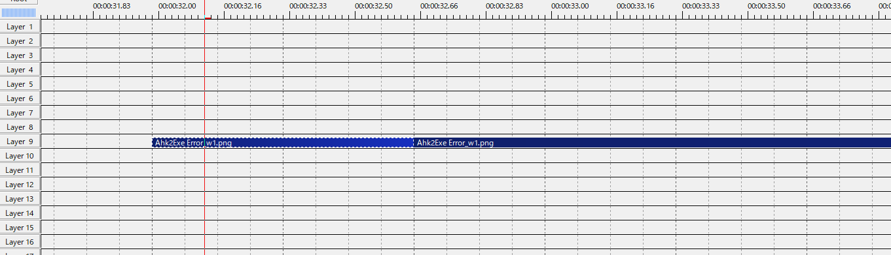
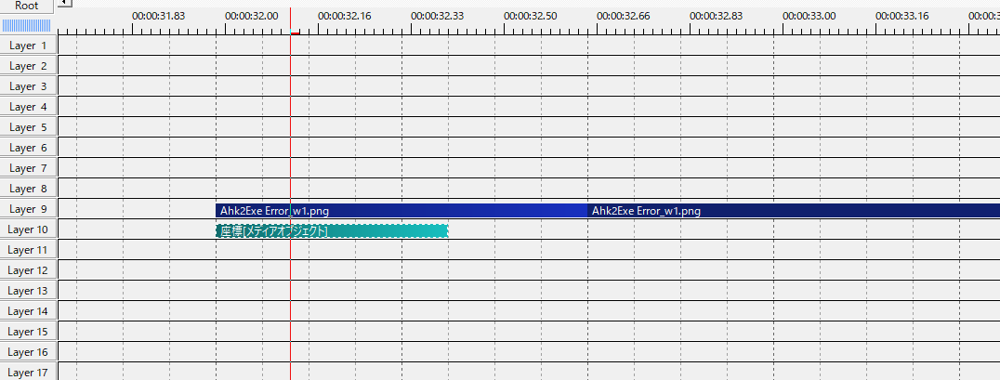
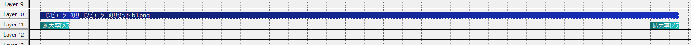
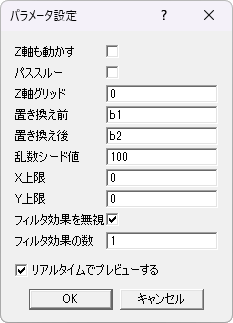

# ちょっとしたTips
少しでも楽に動画が作れるように、隠れた工夫があります。

## グループ化を用いた自動配置
ウィンドウ番号をいちいち設定することは非常に面倒です。そこで、AviUtlの機能、グループ化を用いることで自動的に番号を設定できるようになります。

### 注意
AviUtlで使える機能です。AviUtl2では使えません。

### オブジェクトのグループ化
実際に想定されているパターンは三つです。

#### オブジェクトが二つあるパターン
アクティブ状態のオブジェクト、非アクティブ状態のオブジェクトがあり、起動アニメーションがない場合のパターンです。

#### オブジェクトが二つ、アニメーション効果が一つあるパターン
アクティブ状態のオブジェクト、非アクティブ状態のオブジェクト、起動アニメーションがある場合のパターンです。

#### オブジェクトが二つ、アニメーション効果が二つあるパターン
アクティブ状態のオブジェクト、非アクティブ状態のオブジェクト、起動アニメーション、終了アニメーションがある場合のパターンです。

アニメーションがある場合は、設定が必要です。

CrEasyの設定から、フィルタ効果を無視にチェックを入れます。また、フィルタ効果の数に応じて、数を調整します。

最終的にすべてのオブジェクトをグループ化することで、整列ができるはずです。また、すべてのオブジェクトに非アクティブ化のチェックを入れることで、自動的に非アクティブ化できるようにもできます。